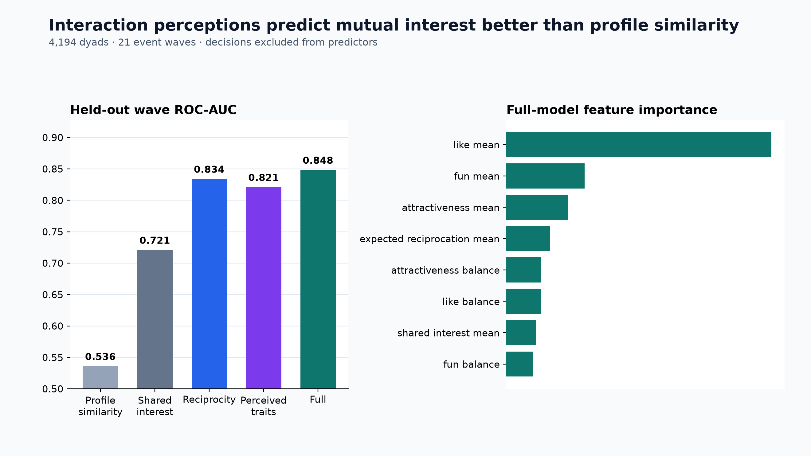

# Speed Dating Connection

Can interaction perceptions predict immediate mutual interest better than profile similarity?

## Result

**Yes, in this structured four-minute setting.** Across 4,194 dyads in 21 Columbia speed-dating
events, reciprocity ratings reached **0.834 ROC-AUC**, compared with **0.721** for shared-interest
signals and **0.536** for pre-existing profile similarity. The reciprocity-minus-shared-interest gap
was **+0.113 ROC-AUC** with a wave-clustered 95% interval of **+0.083 to +0.148**.



| Feature set | ROC-AUC | PR-AUC |
|---|---:|---:|
| Profile similarity | 0.536 | 0.180 |
| Shared interest | 0.721 | 0.359 |
| Reciprocity | **0.834** | **0.498** |
| Perceived traits | 0.821 | 0.479 |
| Full model | **0.848** | **0.547** |

The nuance matters: shared interest is not useless. It is moderately predictive, but materially weaker
than reciprocal liking and perceived traits. `like_mean` is the strongest full-model feature, followed
by perceived fun and attractiveness. Aggregate results are in
[`artifacts/results.json`](artifacts/results.json).

## Leakage-safe design

- **Unit:** one canonical participant dyad within an event wave.
- **Label:** mutual match decision.
- **Profile similarity:** interest correlation, age gap, and same-race indicator.
- **Shared interest:** both post-date shared-interest ratings plus pre-existing interest correlation.
- **Reciprocity:** mean and balance of `like` and expected-reciprocation (`prob`) ratings.
- **Perceived traits:** mean and balance of attractiveness, sincerity, intelligence, fun, and ambition.
- **Evaluation:** five-fold stratified group holdout; entire event waves stay together.

`dec`, `dec_o`, and follow-up fields are banned. This is essential because `match` is the deterministic
conjunction of both participants' decisions. See [`LEAKAGE_AUDIT.md`](docs/LEAKAGE_AUDIT.md).

## Data

The public dataset contains 8,378 directed records, which collapse into 4,194 dyads with 690 mutual
matches. Ten dyads have only one directed record; the source row still contains both participants'
ratings, and all duplicated match labels are consistent.

- [Kaggle: Speed Dating Experiment](https://www.kaggle.com/datasets/annavictoria/speed-dating-experiment)
- [Columbia Business School paper page](https://business.columbia.edu/faculty/research/gender-differences-mate-selection-evidence-speed-dating-experiment)

Raw data is downloaded locally and never redistributed by this repository.

## Reproduce

```powershell
python -m venv .venv
.venv\Scripts\python -m pip install -e ".[model,dev]"

speed-dating-connection prepare `
  data/raw/speed-dating-experiment.zip `
  --output data/processed/dyads.csv

speed-dating-connection benchmark `
  data/processed/dyads.csv `
  --output artifacts/results.json `
  --predictions artifacts/private/predictions.csv `
  --hero-chart artifacts/hero.png

pytest
ruff check src tests
```

## Interpretation boundary

The outcome is immediate mutual interest after a structured four-minute encounter. It is not
friendship, emotional safety, intimacy, commitment, or durable relationship formation. The result is
best read alongside the longitudinal [`connection-dynamics`](https://github.com/evoltriet/connection-dynamics)
study rather than as a substitute for it.
